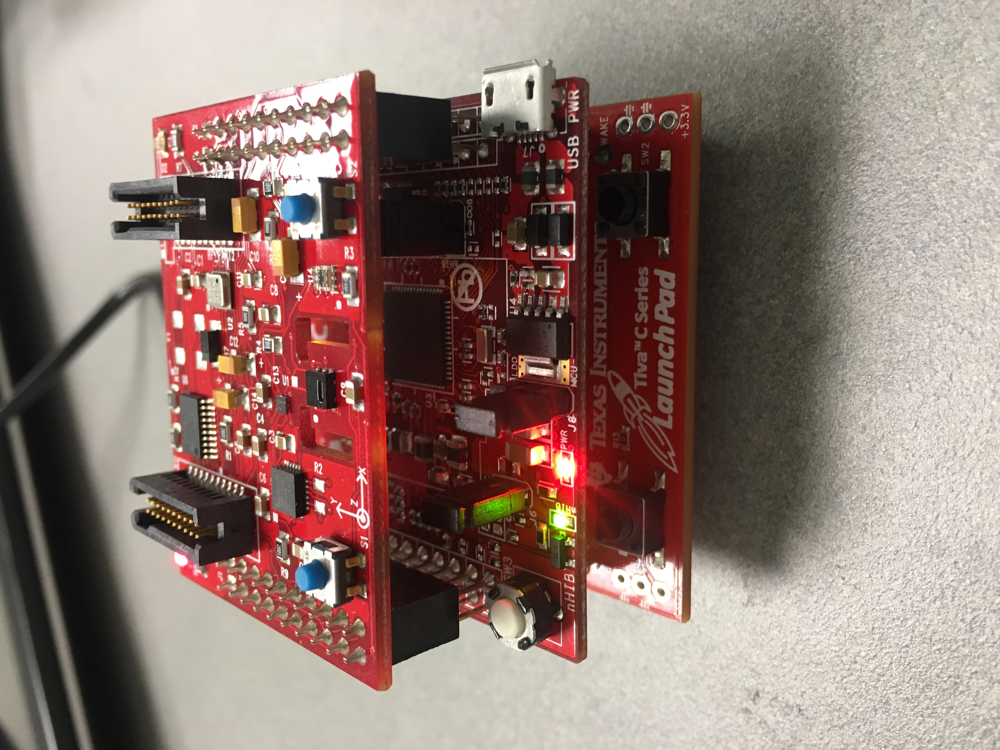
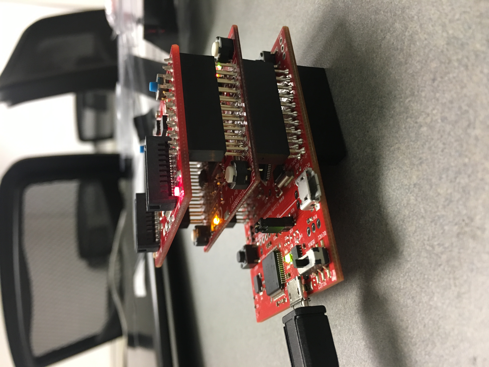
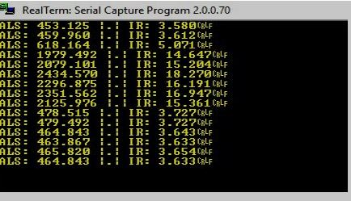

This project makes use of the ISL29023 sensor on the Boostxl – Senshub booster pack.

ISL29023 is a light sensor through which the light intensity value and the amount of IR light value present in the light source surrounding the sensor are calculated.

The calculated are values can be seen using tools like Realterm by setting the baud value to 115200. 

The GPIO A0, A1 are used as UART PINS

The led on the board is configured in such way that whenever the light blinks the data will be displayed in the console. In this project the led blinks every one second i.e the sensor collects the data every second. The readings are displayed up to 3 decimal values.

A bin is created upon executing the files using the make command which can be loaded on to board using LM flash programming tool.

To run this make file the path stored in ROOT variable should be changed to directory where the Tivaware software is installed. Later when make file is run from the working directory the code gets compiled and creates a bin file.

