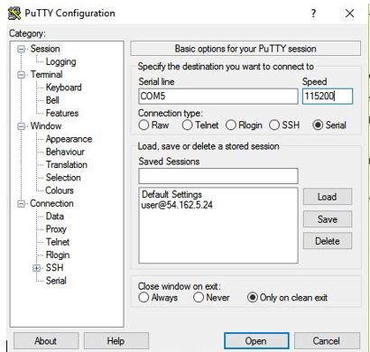
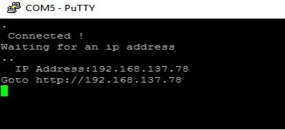
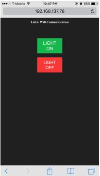
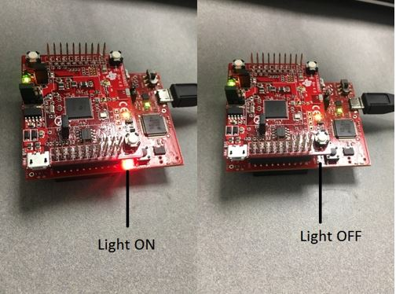

This lab simulates the WIFI-communication (point -point) using the CC3100 booster pack and Tm4c123gxl launch pad.

•	An LED on the Tiva board can be controlled by using a webpage. 

•	The module and the webserver should be connected to the same WIFI network. Two options are provided to the user to either on or off the bulb. When an option is selected the message is transmitted to the board through WIFI.

•	Give the ssid and password in the program as shown below and then build the program and load it on to the board.

char ssid[] = "wifilab";

char password[] = "password1234";

•	To obtain the ip address of the webserver the board should be connected to Putty through serial communication with serial line value of COM5 and with baud rate of 115200

•	Now, the terminal displays the ip address of the web server.

•	Now go the ip address given in the terminal using device which is connected to the same network as CC3100

•	This lab works only when connected to WPA networks.

